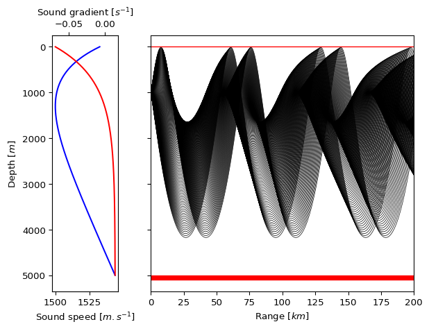

# great Underwater Acoustic Simulator (gUAcS)

## About

This project was created in order to develop knowledge for both the theory/physics of underwater sound propagation as well as skills in programming an functioning software simulation package. This project aims to cover geometric ray tracing, dynamic ray tracing and Gaussian beam tracing for assessment of high frequency sound. As an extension a nodal solver for low frequency sound approximation may be added at a later date.

For a more detailed description of the underlying theory please see the ``docs\theory.tex`` file (this should eventually be compiled as a pdf file and included under the releases section of this page).

## Examples & Theory

For more understanding of the software capability see [examples/examples.md](https://github.com/mv-2/gUAcS/blob/master/examples/examples.ipynb). For details of the theory (which is not always completely up to date) see [docs/theory.pdf](https://github.com/mv-2/gUAcS/blob/master/docs/theory.pdf)
