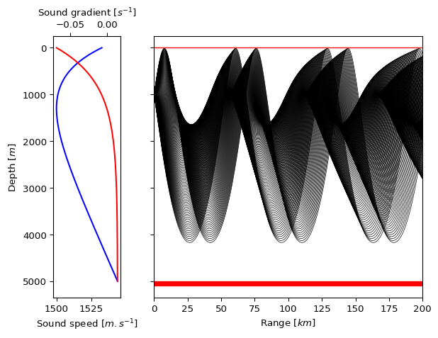
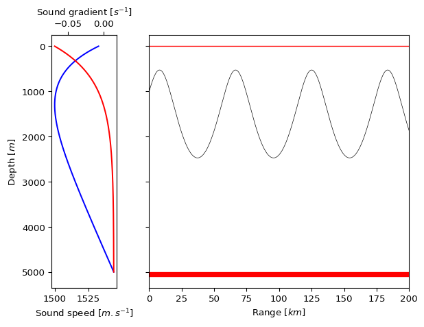
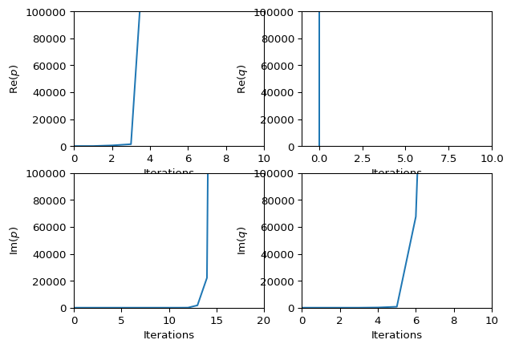
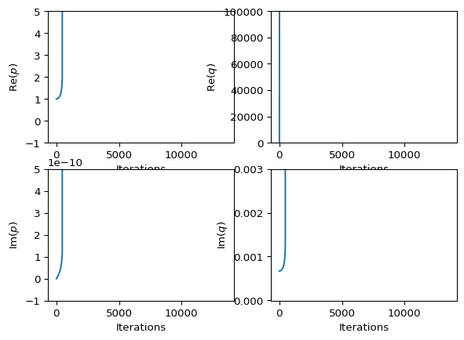

# Setting Performance Expectations


# gUAcS Examples

The following notebook contains some basic usage of the `gUAcS` package.
For more details on the theory in this simulation please view
`docs\theory.pdf`.

# Imports

``` python
import sys
import os
sys.path.append(f"{os.getcwd()}/examples")
from guacs.guacs import (
    trace_rays, 
    trace_beams, 
    RayConfig, 
    BeamConfig, 
    ProgConfig, 
    EnvConfig, 
    SourceConfig, 
    Body, 
    IsoSpace, 
    Ssp,
)
from scipy.interpolate import splrep
import matplotlib.pyplot as plt
from python_utils import (
  munk_profile,
  plot_rays,
  plot_pq,
)
from datetime import datetime
from IPython.display import HTML
```

This will either be run on a reasonably powerful desktop or a laptop
that struggles to boot most days.

``` python
import platform
import psutil
print(platform.processor())
print(f"Physical Cores: {psutil.cpu_count(logical=False)}")
print(f"LogicalCores: {psutil.cpu_count(logical=True)}")
```

    x86_64
    Physical Cores: 2
    LogicalCores: 4

# Geometric Ray Tracing

## Setup

For the first simulation, a single tone source is considered using the
canonical Munk sound speed profile. The programmatic and environmental
data must be defined.

Consider a single tone with a single source at 1000m deoth. For
visualisation purposes reflecting bodies at 0m and 5000m depth are
included.

``` python
sources = [SourceConfig(range_pos=0.0, depth_pos=1000.0, ray_fan_limits=(
    -0.2, 0.2), n_rays=200, source_level=100, frequency=1000.0)]

bodies = [
  Body(
    range_vals=[0.0, 200e3, 200e3, 0.0, 0.0],
    depth_vals=[5e3, 5e3, 5.1e3, 5.1e3, 5e3]
  ),
  Body(
    range_vals=[0.0, 200e3, 200e3, 0.0, 0.0],
    depth_vals=[0.0, 0.0, -1.0, -1.0, 0.0]
  ),
]
```

With the source and body objects defined. A sound speed profile can now
be calculated. This is done by fitting a spline to the canonical Munk
profile. The spline knots, coefficients and order are then passed to an
`EnvConfig` object which the gUAcS package will use to calculate the
sound speed at each depth. The `EnvConfig` object also contains a list
of the bodies, swell height and `IsoSpaces` objects. The use of swell
height and `IsoSpaces` is not relevant for this initial simulation.

``` python
max_depth = 5000
depth_step = 100
ssp_depths = range(-2 * depth_step, max_depth + 3 * depth_step, depth_step)
ssp_vals = [munk_profile(z) for z in ssp_depths]
fitted_spline = splrep(ssp_depths, ssp_vals, k=3)
ssp = Ssp(
    ssp_knots=fitted_spline[0], ssp_coefs=fitted_spline[1], ssp_degree=fitted_spline[2])

env_config = EnvConfig(
  bodies=bodies,
  ssp=ssp,
  swell_height=0.0,
  isospaces=[]
)
```

Lastly, the programmatic elements of the simulation must be defined.
This includes the maximum number of simulation steps, the depth
discretisation, range limits, path for output data and a solver
selection which is used for beam tracing methods. Following this the
overall `RayConfig` object can be constructed.

``` python
prog_config = ProgConfig(max_it=int(1e5), depth_step=1.0, max_range=2e5,
                         min_range=-1.0, output_path="output_data")

config = RayConfig(prog_config=prog_config,
                   env_config=env_config, sources=sources)
```

# Simulation Running & Display

The ray tracing simulation can be run with a single line call of the
`trace_rays` function which returns a list of `Ray` objects containing
the data for each ray path.

``` python
t0 = datetime.now()
rays = trace_rays(config)
t = datetime.now() - t0
print(f"Time required to complete simulation: {t}")
```

    Time required to complete simulation: 0:00:00.590356

To visualise the results call the `plot_rays` function.

``` python
ray_fig = plot_rays(config, rays)
plt.show()
```



The spatial information for the rays looks convincing but it does not
give any indication of the time domain data. For this, the
animate_propagation function may be used. This is commented out for
GitHub to avoid producing a notebook which is too large to view.

``` python
# ani = animate_propagation(config, rays, framerate=1, fast_fwd=1)
# HTML(ani.to_jshtml())
```

# IsoSpace Ray Tracing

As there may be some media which do not have a varying sound speed
profile. To simulate these spaces the `IsoSpace` class is used. This
class has a constant sound speed and density unlike the water column
typically analysed. The config defined earlier can now be modified to
include an Isospace over the entire solution space. Additionally the
total number of rays and maximum number of iterations is reduced as the
isospace tracing method differs from the variable sound speed tracing
method.

``` python
prog_config_iso = ProgConfig(max_it=10, depth_step=1.0, max_range=1e5,
                         min_range=-1.0, output_path="output_data")
sources_iso = [SourceConfig(range_pos=-1.0, depth_pos=1000.0,
                        ray_fan_limits=(-0.1, 0.2), n_rays=1, source_level=150, frequency=1000)]
bodies_iso = []
isospaces_iso = [IsoSpace(body=Body(range_vals=[-1.0, 1e5, 1e5, -1.0, -1.0], depth_vals=[
    0.0, 0.0, 5e3, 5e3, 0.0]), sound_speed=1800.0, density=1000.0)]
env_config_iso = EnvConfig(bodies=bodies_iso, ssp=ssp,
                       swell_height=0.0, isospaces=isospaces_iso)
config_iso = RayConfig(prog_config=prog_config_iso,
                env_config=env_config_iso, sources=sources_iso)
```

Now run the simulation and view the results.

``` python
iso_ray = trace_rays(config_iso)
ray_fig = plot_rays(config_iso, iso_ray)
plt.show()
```


``` python
# ani = animate_propagation(config, iso_ray, framerate=1, fast_fwd=1)
# HTML(ani.to_jshtml())
```

# Beam Tracing

The beam tracing process runs the initial geometric ray tracing
algorithm followed by dynamic ray tracing and finally formulation of the
beams. The beam intensity calculation is not yet implemented but some
details on the dynamic ray tracing (DRT) system and $p-q$ equation
evolution can be included here.

Firstly modify the config file to have a $p-q$ equation solver from the
selection of “BackwardEuler”, “RungeKutta4”, “Radau3IA” and “Radau3IIA”.

``` python
prog_config = ProgConfig(max_it=int(1e5), max_range=2e5, min_range=-1.0,
                         depth_step=1.0, output_path="output_data")
ray_config = RayConfig(prog_config=prog_config,
                       env_config=env_config, sources=sources)
beam_config = BeamConfig(
    ray_config=ray_config, pq_solver="RungeKutta4", pressure_locs=[], window_width=None)
```

To run the simulation call the `trace_beams` function.

``` python
t0 = datetime.now()
beams = trace_beams(beam_config)
t = datetime.now() - t0
print(f"Time required to complete simulation: {t}")
```

    Time required to complete simulation: 0:00:00.846206

By taking the central ray from each beam object the same ray propagation
plot can be created as before with the ray tracing approach.

``` python
rays = [bm.central_ray for bm in beams]
ray_fig = plot_rays(config, rays)
```



The $p-q$ variables (as defined in docs/theory.pdf) can also be viewed
to determine if the solver is stable.

``` python
fig = plot_pq(beams[0:10])
fig.axes[0].set_xlim((0, 10))
fig.axes[1].set_xlim((-1, 10))
fig.axes[2].set_xlim((0, 20))
fig.axes[3].set_xlim((0, 10))
```



By inspection, the RungeKutta4 method is unstable. This is likely as it
is an explicity solver. For a better chance, try the Radau3IIA method as
this is an implicit solver for stiff equations.

``` python
beam_config = BeamConfig(
    ray_config=ray_config, pq_solver="Radau3IIA", pressure_locs=[], window_width=None)
t0 = datetime.now()
beams = trace_beams(beam_config)
t = datetime.now() - t0
print(f"Time required to complete simulation: {t}")
fig = plot_pq(beams[0:10])
fig.axes[0].set_ylim((-1, 5))
fig.axes[2].set_ylim((-1e-10, 5e-10))
fig.axes[3].set_ylim((-1e-5, 3e-3))
```

    Time required to complete simulation: 0:00:00.820478



This solver appears to be more stable but there are still significant
issues with divergence after ~1000 iterations. Until this stability
issue is explained or solved, pressure evaluation in the sound field
cannot be accurately completed.
